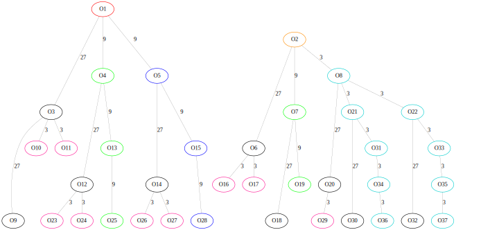

# Overview

This repository contains Magma code to

* Enumerate suborders/superorders of a given quaternion order
  (originally based on code by M. Kirschmer and D. Lorch).
* Classify definite orders that are Hermite rings, respectively, have
  locally free cancellation.

Moreover it contains a computer readable list of all definite Hermite quaternion orders over
a ring of integers in a number field.

The code accompanies the paper

D. Smertnig, J. Voight, Definite orders with locally free cancellation, Trans. London Math. Soc. 6 (2019), no. 1, 53–86.

Tested with Magma V2.24-5.

# Usage

To use the package, it must first be imported.
```
AttachSpec("Hermite.spec");
```

Load the definite Hermite quaternion orders, respectively the ones with locally free cancellation.
```
orders := LoadOrders("hermite.dat");
orders_c := LoadOrders("cancellation.dat");
```
The ones with cancellations can also easily obtained via
```
orders_c := [ O : O in orders | HasCancellation(O) ];
```
but that takes a few minutes, as the class sets and stable class groups have to be computed.

The variable `orders` is a list of quaternion orders. We a priori fix representatives for
the base fields, and `orders` contains the 375 orders up to isomorphisms R-algebra
automorphism, where R is the center. To produce the 303 orders up to ring automorphisms from
this list, use `DedupOrders`.

To rerun the classification yourself use
```
SetVerbose("Quaternion", 1);
res := FindHermiteOrders();
orders := OrdersAsList(res);
orders_c := [ O : O in orders | HasCancellation(O) ];
```

It takes less than an hour on my Laptop (i7-7600U).

## Example: Enumerating suborders

This example demonstrates how to enumerate all suborders of a quaternion order up to local
isomorphism and a bounded index.

```
QQ := RationalsAsNumberField();
ZZ := Integers(QQ);
B := QuaternionAlgebra< QQ | -1, -1>;
O := MaximalOrder(B);
p := 3*ZZ;

G := EnumerateSubordersAtP(O, p, 6);
```
Here `6` means to enumerate orders up to index `p^6`.

The output is organized as a graph by radical idealizers. The orders themselves are attached
to the vertices as labels. The structure can be visualized:
```
SaveOrdersGraphToDot(G, "suborders.gv" : ColorFunc := func< v | ColorClassesAtP(3*ZZ, v) >);
```
Then call Graphviz from the command line
```
dot -Gsize=10 -Tsvg suborders.gv -o suborders.svg
```

This produces



To access the order `O16` (it's Gorenstein, but not Bass, because it's pink!),
```
V := VertexSet(G);
O16 := Label(V.16);
print Generators(O16);
```
produces
```
[ 1, 27*i, -6*i + 3*j, 1/2 - 9/2*i + 3/2*j + 3/2*k ]
```

There is also `EnumerateSuborders`, which recurses over multiple primes, and
`EnumerateSuperordersAtP` for computing superorders.  To obtain representatives for the
global isomorphism classes of orders, pass the optional parameter `UpTo := "Isomorphism"`.

# File layout

* `EnumOrders/`  Code for enumerating orders (independent of Hermite)
  * `enum_suborders.m`:
    Functions for enumerating suborders of a given quaternion order,
    possibly picking out a given class of orders using a selection
    function.

  * `enum_superorders.m`:
    Functions for enumerating superorders of a given quaternion order,
    possibly picking out a given class of orders using a selection
    function.

  * `orders_aux.m`:
    Auxiliary (mathematical) functions for quaternion orders:
    residue rings, radical idealizer, subalgebras of finite algebras.

  * `list_helpers.m`:
    Functions to help dealing with graphs or lists of quaternion
    orders.

  * `tree_helpers.m`:
    Helper to handle constructing the graph data structrue in
    `enum_suborders.m`.


* `Hermite/`        Code for classifying Hermite orders
  * `classify_hermite.m`:
    Contains the actual logic for running over the fields, algebras,
    and maximal orders that need to be checked. Calls
    `EnumerateOrders`.

  * `bounds.m`:
    Some helper functions related to the computation on bounds of
    indices and discriminants needed in the classification.

  * `stable_class_group.m`:
    Computation of the stable class group, right class set, and
    checking the Hermite property, respectively, cancellation for an
    order.

  * `helpers.m`:
    A few small helper functions that are used in saving, loading,
    and printing orders.

  * `loadsave.m`:
    Functions for saving and loading lists of orders (plus extra
    data) in computer-readable format.

  * `print.m`:
    Functions for creating a textual representation of the list of
    orders.

* `run_classification.m`:
  Runs the classification of Hermite orders and saves the output to
  a computer-readable file.

* `load_classification.m`:
  Loads the classification of Hermite orders from a previously saved
  file.

# Data format

The output of the classification (`hermite.dat` and `cancellation.dat`) is formatted as
follows.  Each file contains a Magma list of tuples `[ <O₁,e₁>, <O₂,e₂>, ... ]` where `Oᵢ`
represents the `i`th order, and `eᵢ` contains additional metadata about the order.

* `Oᵢ = [ F, a, b, [γ₁, ..., γₘ] ]` where
  * `F = [f₀, f₁, ..., fₙ]` represents a number field given by `F≃Q[x]/(f)` with defining
    polynomial `f=f₀ + f₁ x + ... + fₙxⁿ`. Denoting by `α` the image of `x` under this
    isomorphism, an element of `F` is encoded as `[c₀, ..., cₙ₋₁]`, representing
    `c = c₀ + c₁ α + ... + cₙ₋₁ αⁿ⁻¹`.
  * `a`, `b` are elements of `F`, corresponding to parameters of the quaternion algebra `B`
     with `i²=a`, `j²=b`, `k=ij=-ji` over `F`. Elements `γ` of `B` are then represented by
     `[g₁,g₂,g₃,g₄]` with `γ = g₁ + g₂i + g₃j + g₄k`.
  * `γ₁`, ..., `γₘ` are elements of `B` that are generators for the order.
* `eᵢ = <H, G, c, P, t, h>` where
  * `H` is the cardinality of the (right) class set.
  * `G` is the cardinality of the stable class group.
  * `c` is `1` if the order has locally free cancellation, and `0` if it is Hermite but
    does not have locally free cancellation.
  * `P` is `4`, `3`, `2`, `1`, `0`, `-1` if the order is maximal, hereditary, Eichler,
    Bass, Gorenstein, or non-Gorenstein (that is `P` represents the most restrictive of
    these properties applying to the order)
  * `t` is the type number, that is, the number of isomorphism classes of orders locally
    isomorphic to `Oᵢ`
  * `h` is the class number of the underlying ring of integers.
